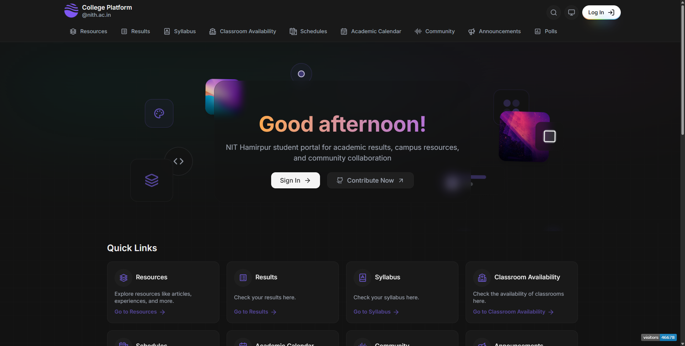

# College Ecosystem

[](https://github.com/kanakkholwal/college-ecosystem/actions/workflows/deploy-servers.yml)

**College Ecosystem** is a monorepo for various projects aimed at creating a comprehensive platform for managing and interacting with different aspects of a college environment. It includes frontend applications built with Next.js and a backend server using Express and TypeScript.

[](https://app.nith.eu.org)

Learn more

[](https://deepwiki.com/kanakkholwal/college-ecosystem)
<!-- Welcome to the College Ecosystem monorepo, housing various projects related to college management and services. This repository utilizes Yarn Workspaces and Turbo Repo for efficient project management. -->

## Table of Contents

- [Apps](#apps)
- [Project Structure](#project-structure)
- [Tech Stack](#tech-stack)
- [Deployment](#deployment)
- [Contributing](#contributing)
- [Platform Features](#features)
<!-- - [License](#license) -->

## Apps

- [**Platform**](https://app.nith.eu.org): A Next.js application for the main platform.
- [**Website**](https://nith.eu.org): A Next.js application for the college website.
- **Server**: An Express server with TypeScript for backend operations.
- **Modular Architecture**: Scalable and maintainable project structure.

## Project Structure

```bash
/college-ecosystem
  /apps
    /platform      # College Platform (app.nith.eu.org)
    /website       # Website          (nith.eu.org)
  /turbo.json      # Turbo Repo configuration
  /package.json    # Root package.json with Yarn workspaces configuration
  /.gitignore      # Git ignore file
  /README.md       # This readme file
```

## Tech Stack

- **Frontend**: Next.js, React, TypeScript
- **Backend**: Express, TypeScript, Node.js
- **Database**: MongoDB with mongoose,Upstash Redis, Postgres SQL with Drizzle ORM
- **Build Tools**: Turbo
- **Other**: Docker, ESLint, Prettier (Biome on local), Jest

## Deployment

### GitHub Actions

We use GitHub Actions to automate the deployment process for both Vercel and Docker, [deploy](.github/workflows/deploy.yml).

## Contributing

We welcome contributions! Please see our [CONTRIBUTING.md](CONTRIBUTING.md) for more details.

## Features
The College Ecosystem application is a comprehensive educational platform with the following major features:

### Academic Management Features
- **Academic Results Portal** - Search and view semester results, grades, and academic performance with filtering by batch, branch, and programme.
- **Syllabus Search** - Browse and search course syllabi by department and type  
- **Academic Calendar** - View academic events, important dates, and semester schedules with calendar and list views 
- **Class Schedules** - Access timetables and class scheduling information  

### Campus Resources
- **Classroom Availability** - Check real-time availability of classrooms and rooms for booking  
- **Resource Portal** - Access articles, experiences, and educational content with advanced search and filtering  

### Community Features
- **Community Posts** - Share and interact with community content like Reddit 
- **Polls System** - Participate in community polls and voting 
- **Announcements** - View latest college announcements and updates 

### Administrative Features (Role-Based)
- **User Management** - Admin tools for creating and managing users 
- **Result Management** - Administrative tools for result scraping, importing, and bulk operations 
- **Academic Events Management** - Create and manage academic calendar events 
- **Course Management** - Manage course information and syllabi 
- **Room Management** - Administer classroom and facility bookings 
- **Hostel Management** - Manage hostel information and functionaries

### Student-Specific Features
- **Personal Attendance** - Track individual attendance records 
- **Out Pass System** - Apply for and manage out passes for hostellers

### Technical Features
- **Role-Based Access Control** - Different features available based on user roles (Admin, Faculty, Student, etc.)
- **Progressive Web App** - Mobile-responsive design with PWA capabilities 
- **Real-time Updates** - Live data synchronization and notifications
- **Search and Filtering** - Advanced search capabilities across all content types

## Notes

The application is built as a monorepo with separate platform and server applications. The platform uses Next.js for the frontend while the server provides REST APIs using Express and TypeScrip . The system supports multiple user roles including Admin, Faculty, Student, HOD, CR, and various hostel management roles, with features dynamically shown based on permissions .

